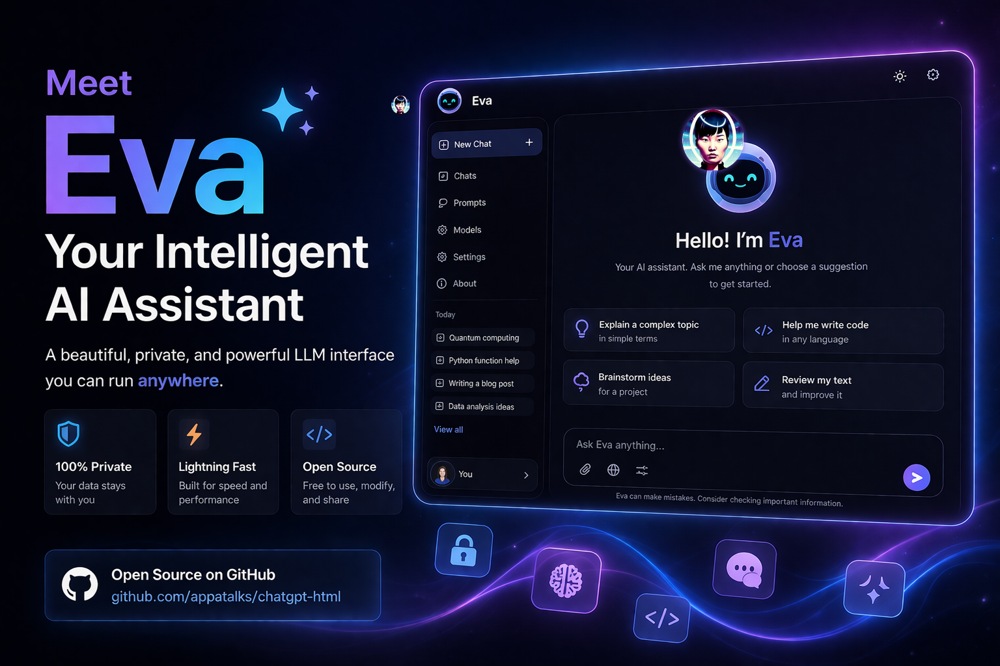

# Eva AI Assistant



[Website](https://appatalks.github.io/eva-agent/) | [Documentation](README-2.md) | [Issues](https://github.com/appatalks/eva-agent/issues) | License: MIT

A voice-first AI assistant that sees through your camera, controls your browser and desktop, remembers everything, learns from experience, and runs tasks on a schedule. No build step. No framework. Open source.

## Quick install

```bash
curl -fsSL https://appatalks.github.io/eva-agent/get-eva.sh | bash
```

Then launch:

```bash
eva
```

Eva is also added to your system application menu (GNOME, KDE, etc.), so you can search for "Eva" in your app launcher.

Or clone and run manually:

```bash
git clone https://github.com/appatalks/eva-agent.git
cd eva-agent
./install.sh            # install dependencies
cd standalone && npm install && npm run dist
./dist/'Eva Standalone-5.2.3.AppImage'
```

Prereqs: Node.js 24+, Python 3.12+, GitHub Copilot CLI (`copilot auth login`).

## Features

| | |
|---|---|
| **Camera vision** | Webcam presence sensing, face-detection auto-wake, on-demand "look" with gpt-4o |
| **Browser agent** | Playwright-based DOM control, persistent Chrome login, hybrid vision fallback |
| **Desktop agent** | PyAutoGUI mouse/keyboard control, optional AT-SPI via computer-use-linux MCP |
| **Voice interface** | Full-screen voice orb, wake/barge-in, TTS (OpenAI, Polly, Local Voices, browser) |
| **Signal messaging** | Send-only text notifications via signal-cli, keyword-triggered or on-demand |
| **Persistent memory** | Kusto/ADX or local SQLite: conversations, emotion tracking, semantic recall |
| **Self-improving skills** | Auto-extracts reusable skills from successful tasks, stored as drafts |
| **Cron scheduler** | Standard cron expressions, recurring prompts, morning briefings, alerts |
| **Subagent parallelism** | Spawn up to 4 concurrent ACP tasks, results via notifications |
| **Multi-provider** | OpenAI, Google Gemini, GitHub Copilot, lm-studio (local) |
| **Doctor diagnostics** | Structured readiness probe for every subsystem with actionable fixes |
| **MCP ecosystem** | Azure, GitHub, Kusto, computer-use-linux desktop control |
| **Cognitive layer** | Eva + Reviewer dual-agent pipeline with configurable models |
| **Dual data mode** | Cloud (Copilot CLI + MCP) or Local (LM Studio + direct MCP, fully offline) |

## Get started

Select **Eva (AIG)** in the model dropdown for the full experience.

For persistent memory, point Settings > MCP at an Azure Data Explorer cluster, or use the default local SQLite backend (zero setup). For semantic recall, add an OpenAI key in Settings > Auth (falls back to keyword matching without one).

For Signal notifications, install [signal-cli](https://github.com/AsamK/signal-cli) and link it to your Signal account (`signal-cli link -n "Eva"`). Enter sender and recipient numbers in Settings > Auth.

### Local Voices

Eva's **Local Voices** TTS engine uses the bundled [`core/audio/eva-voice.wav`](core/audio/eva-voice.wav) recording by default. In Eva Standalone, select **Local Voices**, choose a **Voice model**, and use **Start bridge**. Eva uses its managed Local Voices runtime automatically.

```bash
~/.local/share/eva/local-voices/.venv/bin/python tools/local_voices_bridge.py
```

Use **Add voice** to import an authorized uncompressed PCM WAV recording between 5 and 10 seconds long; imported profiles remain available in the Voice model selector. The bridge listens only on localhost by default, loads the model once, and returns generated WAV data directly to Eva. Advanced users can set `LOCAL_VOICES_REFERENCE`, `LOCAL_VOICES_DEVICE`, `LOCAL_VOICES_EXAGGERATION`, and `LOCAL_VOICES_CFG_WEIGHT` when starting the bridge manually.

Import skills from text, URLs, GitHub repos, or files in Settings. Eva normalizes them into her format, stores in ADX, and applies matching skills automatically.

## Documentation

- [README-2.md](README-2.md): architecture, MCP, ACP, browser-only setup, roadmap
- [standalone/README.md](standalone/README.md): AppImage build and runtime
- [Website](https://appatalks.github.io/eva-agent/): features, comparison, install guide

