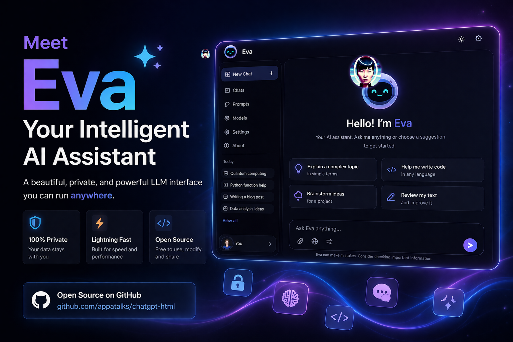
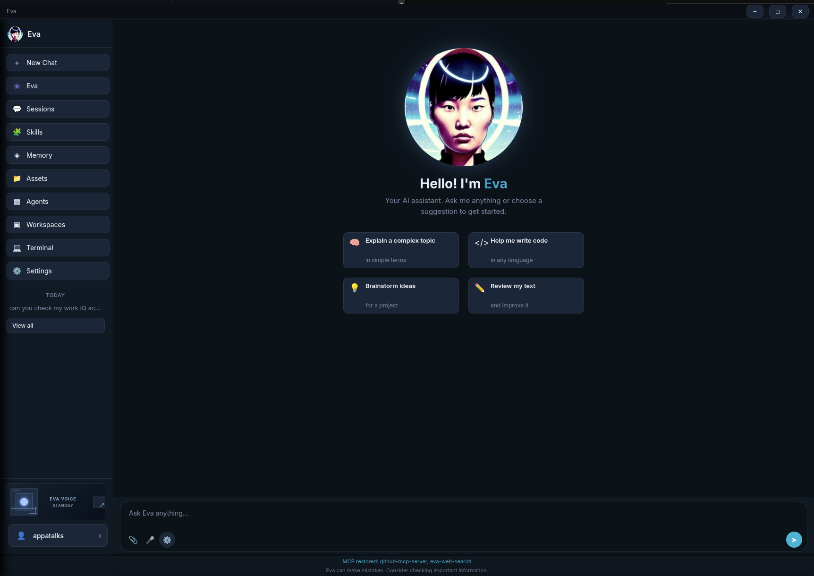
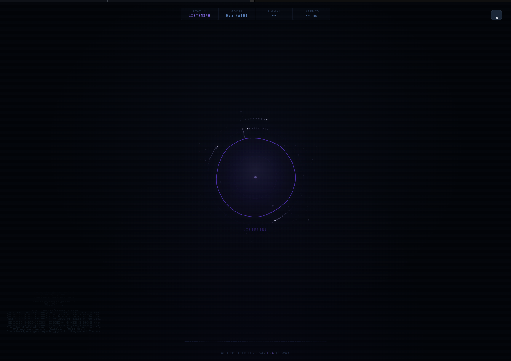
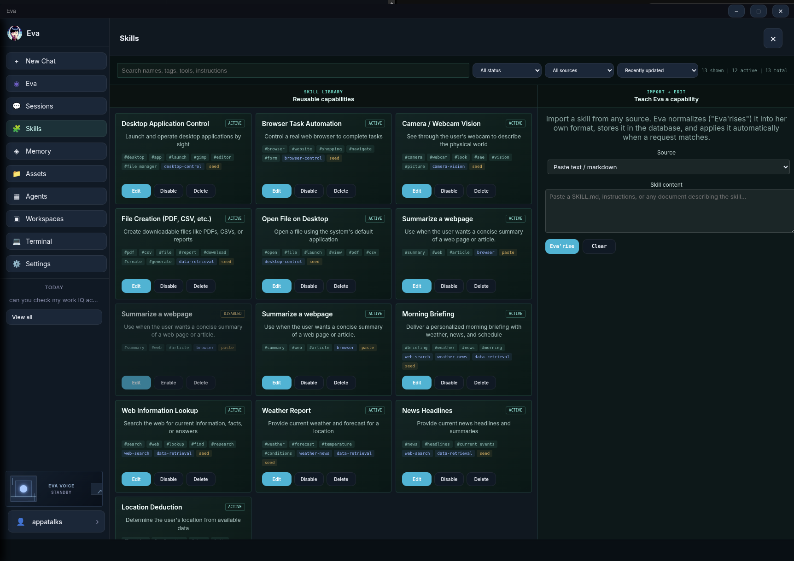
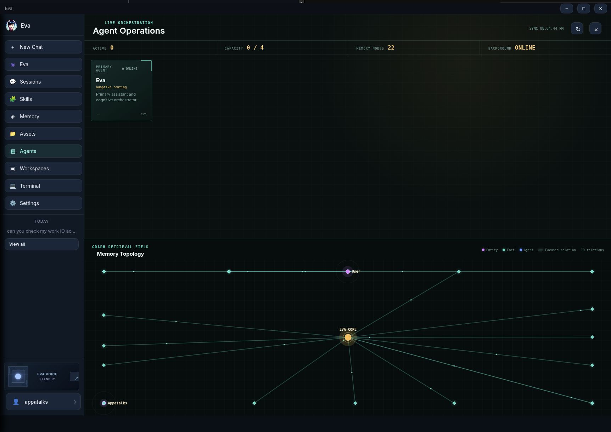
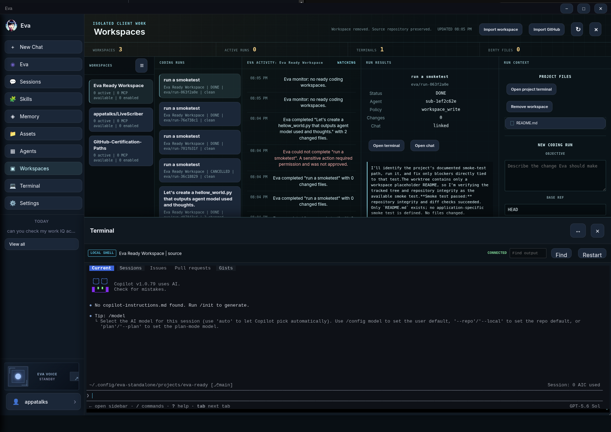
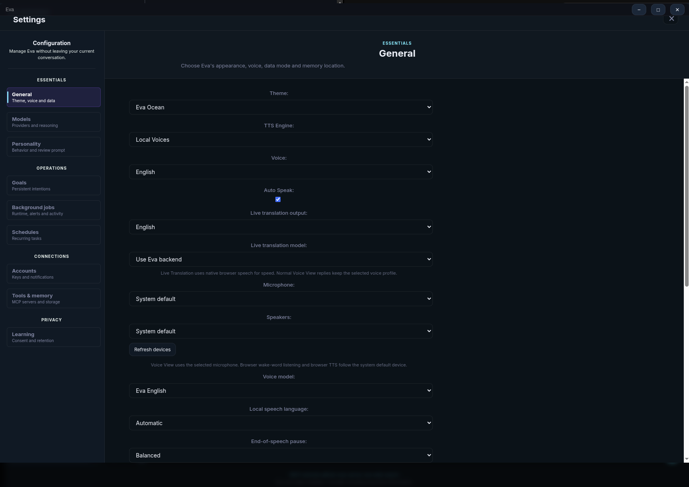

# Eva AI Assistant

[Website](https://appatalks.github.io/eva-agent/) | [Documentation](README-2.md) | [Issues](https://github.com/appatalks/eva-agent/issues) | License: MIT

A voice-first AI assistant for conversation, memory, automation, and local or cloud-backed work. Eva can use voice, camera, browser, desktop, MCP tools, skills, and coding workspaces with optional auto approval while keeping control and configuration on your machine.

## In Use

<table>
	<tr>
		<td width="50%"></td>
		<td width="50%"></td>
	</tr>
	<tr>
		<td width="50%"></td>
		<td width="50%"></td>
	</tr>
	<tr>
		<td width="50%"></td>
		<td width="50%"></td>
	</tr>
</table>

## Quick install

```bash
curl -fsSL https://appatalks.github.io/eva-agent/get-eva.sh | bash
```

Then launch:

```bash
eva
```

Eva is also added to your system application menu.

Current standalone release: `Eva Standalone-5.5.12.AppImage`.

On first launch, choose **Eva (AIG)** in the model menu for the integrated experience. Eva works with local SQLite memory by default; provider keys, Copilot, and other optional capabilities are configured in Settings.

For a source build, platform-specific packaging, Local Voices, providers, memory, MCP, or workspace setup, use the [technical documentation](README-2.md).

## Documentation

- [README-2.md](README-2.md): setup, providers, memory, voice, MCP, workspaces, architecture, and roadmap
- [standalone/README.md](standalone/README.md): AppImage build and runtime
- [docs/ai-development-guide.md](docs/ai-development-guide.md): focused development workflow, ownership map, and validation bundles
- [docs/frontend-ownership.md](docs/frontend-ownership.md): browser feature owners, collaborators, and classic-script migration rules
- [docs/testing-contracts.md](docs/testing-contracts.md): behavior, security, and compatibility test policy for refactors
- [docs/deprecation-inventory.md](docs/deprecation-inventory.md): active compatibility paths and evidence required before removal
- [docs/contracts/provider-routing.md](docs/contracts/provider-routing.md): selectable model routing and provider-mapping contract
- [Website](https://appatalks.github.io/eva-agent/): features, comparison, install guide

