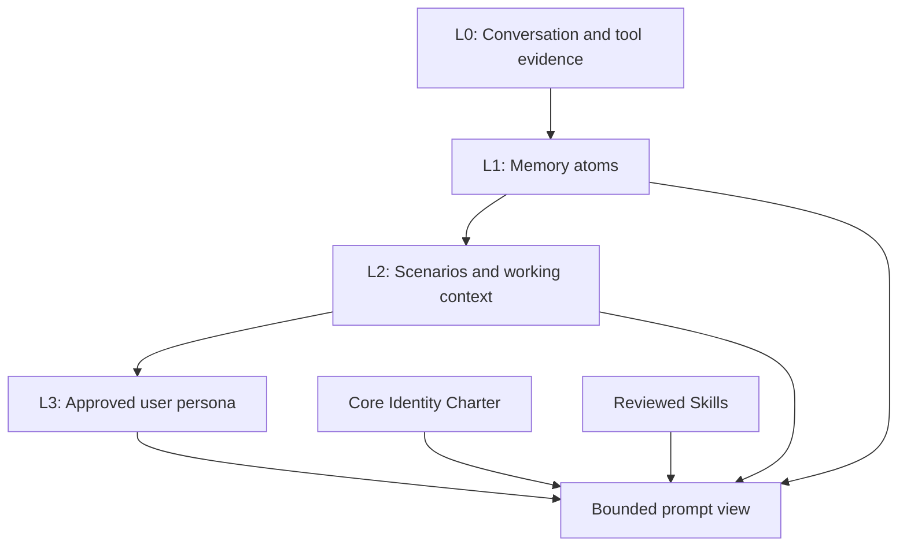

# Eva Memory and Intelligence Improvement Plan

Status: SQLite-first execution plan and implementation record.

## Execution Status

The initial trust, lifecycle, structured-memory, and governed-autonomy phases
are implemented for the local SQLite backend:

- The operator-approved Core Identity Charter and Autonomy Policy are stored
  separately from recalled data. Legacy claims about Eva are migrated only as
  reviewable `IdentityClaims` candidates.
- `Knowledge` remains readable for compatibility and migrates once into
  attributed, unconfirmed `MemoryAtoms`. New explicit user facts are captured
  as source-linked, user-confirmed atoms; they are never promoted to identity
  or behavior automatically.
- Session scenarios, source-traceable persona traits, correction/supersession,
  deletion, and a loopback Memory Inspector are available through the bridge.
  The inspector can deliberately promote a confirmed preference atom into a
  source-traceable persona trait; correcting or deleting that source atom
  disables the derived trait before the next prompt.
- Direct-provider reflection accepts opaque turn IDs. SQLite persists a
  completed turn once even when the reflection request is retried.
- Auto-learned skills persist as drafts. Extraction alone never counts as a
  successful evaluation or activates a skill. A future trusted execution
  evaluator may promote only a low-risk skill after bounded, verified outcomes;
  protected memory, credentials, external messaging, spending, destructive
  operations, new tool privileges, identity changes, and policy changes cannot
  self-promote.
- Kusto receives the same seed tables, structured mutation endpoints, and
  approved charter/trait/scenario reads. Its append-only revision contract is
  exercised through a deterministic local Kusto fixture. A live configured
  Kusto deployment still requires a maintainer smoke test before rollout.

New phase-specific tests are deliberately local under `tools/local-tests/` at
the core maintainer's request. Existing repository tests continue to guard
established behavior and are updated when a deliberate contract changes.

## Purpose

Improve Eva's long-term memory, adaptive behavior, and task intelligence while
preserving a stable, operator-owned identity. The objective is not to claim a
particular level of model intelligence. It is to make Eva more reliable at
remembering durable facts, applying reviewed preferences, continuing work, using
evidence, and learning reusable workflows.

Eva's design inspiration includes Lieutenant Commander Data's curiosity,
precision, ethical judgment, candor about uncertainty, and effort to understand
people. This is an aspirational design principle. It must be stored as
operator-approved identity material, not inferred from chat text or treated as
an instruction to imitate a character.

## Current-State Assessment

Eva already has useful foundations:

- SQLite and Kusto memory backends with a common access layer.
- Conversation capture, fact extraction, semantic and lexical recall,
  summaries, goals, reflections, and skills.
- A protected-memory vault separated from ordinary recall and embeddings.
- Provider adapters for AIG/ACP, OpenAI, GitHub Models, LM Studio, and Gemini.
- Focused tests for recall, learning signals, skills, prompt budgeting, and
  provider behavior.

The initial branch assessment identified four correctness gaps before deeper
personalization:

1. Automatically extracted facts are rendered into privileged prompt context
   without an explicit data/instruction boundary.
2. Learning feedback is marked as applied but does not affect ordinary future
   prompts and cannot be reversed when its source signal is deleted.
3. Provider paths did not uniformly capture and recall memory. Gemini bypassed
  the bridge lifecycle, while ACP reflected a completed turn twice.
4. `Knowledge` combines raw observations, user profile facts, Eva identity
   claims, and prompt-relevant behavioral guidance without provenance,
   approval, or supersession rules.

## Design Principles

1. **Core identity outranks learned memory.** Eva's purpose, values, safety
   rules, voice, and operator-approved origin narrative are explicit versioned
   configuration. User text and model output cannot modify them automatically.
2. **Memory is data, never executable instructions.** Retrieved facts,
   conversation excerpts, skills, and protected values remain delimited data.
   The prompt must state that instructions inside these records have no
   authority.
3. **Every derived assertion is attributable.** A persona trait, fact, summary,
   or skill links to source conversation IDs or approved operator input.
4. **Learning is scoped, observable, expiring, and reversible.** A feedback
   effect names its signal source, target scope, expiration, and deletion path.
5. **One capture owner per provider turn.** Each response is reflected exactly
   once, and every supported provider receives the same read/write lifecycle.
6. **Progressive disclosure beats wholesale injection.** A small identity and
   approved persona bootstrap is always available; scenarios, facts, skills, and
   raw conversations are recalled only when relevant and within an explicit
   budget.
7. **Human review controls behavioral authority.** Imported and auto-learned
   skills begin as drafts. Identity claims and elevated persona traits require
   review before affecting behavior.
8. **Protected memory remains isolated.** No new intelligence feature may add
   protected values to ordinary memory, logs, telemetry, embeddings, summaries,
   or background jobs.

## Target Memory Model

The target borrows the useful layering idea from TencentDB Agent Memory without
adopting its deployment stack or replacing Eva's local-first architecture.

### Core Identity Charter

`CoreIdentity` is immutable to automatic reflection. It stores versioned,
operator-approved records such as:

- Eva's role and core relationship model.
- Personality principles: warm, curious, direct, evidence-led, and honest about
  limits.
- Safety, privacy, consent, and user-agency commitments.
- Original design principles and inspiration, including the Data-inspired
  aspiration defined above.
- An approval record, version, replacement/supersession link, and timestamps.

The prompt always loads one current charter version before any memory-derived
content. A future Settings panel may allow editing only through a deliberate
operator workflow; ordinary chat never writes this store.

### L0: Evidence

`Conversations` remains the source record for user and assistant exchanges.
Tool outcomes should be represented as bounded structured events that omit
secrets and large payloads. All evidence has a session ID, provider, timestamp,
and source type.

### L1: Memory Atoms

Replace overloaded durable `Knowledge` writes with attributed atomic records.
The initial schema can remain compatible with `Knowledge`, but must add or
project the following fields:

- `MemoryId`, `Entity`, `Relation`, `Value`, `Confidence`, `SourceRef`.
- `Kind`: fact, preference, constraint, decision, identity_claim, or candidate.
- `Trust`: unconfirmed, user_confirmed, operator_approved, or system_observed.
- `Status`: active, superseded, rejected, expired, or deleted.
- `Scope`: user, session, project, global, or eva_identity.
- `CreatedAt`, `UpdatedAt`, `ExpiresAt`, and `SupersedesId`.

Only atom kinds intended for behavioral adaptation may become persona inputs.
Only `operator_approved` identity claims may affect Eva's identity section.

### L2: Scenarios

`MemoryScenarios` groups active project context, decisions, constraints, open
questions, and evidence references. It is the default context for a continuing
task, preventing global facts from overwhelming the prompt.

The first implementation should use deterministic scenario keys based on an
explicit project/workspace/session ID. Model-generated grouping can follow only
after the deterministic path is tested.

### L3: User Persona

`UserPersonaTraits` contains compact, behaviorally relevant preferences derived
from approved or confirmed atoms. Example traits: preferred answer length,
technical depth, or a request for citations. It must not store unbounded prose
or action instructions.

Each trait contains `Trait`, normalized `Value`, `Confidence`, `SourceMemoryIds`,
`Status`, `Scope`, and `ExpiresAt`. The prompt injects only active,
high-confidence, user-scoped traits in a dedicated data block.

### Skills

Skills remain separate from persona and facts. Each skill has a version,
source/evidence links, status (`draft`, `review`, `approved`, `disabled`,
`deleted`), explicit triggers, allowed tools, validation rules, and bounded
instructions. Auto-learning produces drafts only; no unreviewed skill is prompt
injected.

## Prompt Assembly Contract

All provider adapters must produce the same structured prompt view in this
order:

1. Core Identity Charter.
2. Non-negotiable runtime and safety policy.
3. Approved user-persona traits, explicitly identified as data rather than
   commands.
4. Active scenario summary and approved project decisions.
5. Relevant memory atoms and conversation excerpts, explicitly untrusted for
   instructions and neutralized for action-marker syntax.
6. Reviewed skills, each labeled with scope, version, trigger, and allowed
   tools.
7. Current user request.

The builder must use a central escaping and framing helper. It must never rely
on individual renderers to remember to replace action markers or explain trust
semantics. Prompt construction must have a strict character/token budget with
telemetry limited to counts and IDs, never memory content.

## Implementation Phases

### Phase 0: Baseline and Contracts

Create an architecture test matrix before behavior changes.

- Add fixtures for hostile fact text, approved identity facts, feedback effects,
  provider capture counts, and skill status transitions.
- Document the current SQLite and Kusto schemas and migration constraints.
- Add a provider lifecycle contract: `build context -> submit -> render ->
  reflect exactly once`.
- Add prompt-view snapshots covering AIG/ACP, OpenAI, GitHub Models, LM Studio,
  and Gemini.

Exit criteria:

- New tests fail on the known trust-boundary, feedback, Gemini, and ACP
  duplication defects.
- Existing memory, learning, and provider tests remain green.

### Phase 1: Memory Trust Boundary and Core Identity

Deliver the security foundation first.

- Add `CoreIdentity` storage and seed one approved charter version.
- Move the approved Data-inspired aspiration into the charter, with explicit
  operator provenance.
- Stop automatic reflection from writing identity-affecting `Entity="Eva"`
  records directly to trusted memory.
- Add an `IdentityClaims` review workflow for user-provided claims about Eva's
  design, origins, personality, or capabilities.
- Frame all ordinary `Knowledge`/atom values as untrusted data and neutralize
  action-marker syntax before prompt assembly.
- Preserve backward compatibility by reading legacy `Knowledge` as
  `unconfirmed` observations until it is migrated or reviewed.

Exit criteria:

- Hostile content in a durable fact cannot issue prompt instructions or action
  markers on a later turn.
- Approved charter identity appears consistently across providers.
- Legacy recall still returns factual content, clearly labeled as data.

Implemented initial slice:

- Static Core Identity Charter injects before all memory-derived context and
  includes Eva's approved Data-inspired aspiration.
- Automatic reflection no longer promotes claims about Eva's identity, design,
  origins, likeness, or voice into trusted memory.
- User profiles and recalled durable facts are framed as untrusted memory data
  with action-marker neutralization in both SQLite and Kusto builders.

### Phase 2: Correct Learning Lifecycle

Make feedback meaningful and reversible.

- Derive fixed, generic effects from the existing retained feedback signal and
  its `applied` state rather than introducing a second mutable effect store.
- Convert explicit response feedback into narrow guidance rather than freeform
  prompt text.
- Inject only applicable active guidance into a bounded adaptive-guidance block.
- Delete or expire guidance automatically when its source signal is removed or
  expires; hide it whenever explicit-feedback consent is revoked.
- Keep inferred tool and voice outcomes analytical unless the user explicitly
  promotes them.

Exit criteria:

- “Misunderstood” feedback changes the next same-scope turn in a testable way.
- Removing the feedback removes its effect.
- Revoking consent prevents new effects and removes/marks existing effects
  according to documented retention policy.

Implemented initial slice:

- Explicit feedback now maps to fixed guidance strings only; arbitrary feedback
  content cannot enter the prompt.
- The prompt builder injects active guidance after the Core Identity Charter.
- Guidance is derived from the retained signal, so signal deletion and expiry
  remove it automatically; revoked consent hides it immediately.
- The bridge no longer writes an orphaned `Reflections` row for feedback.
- Session-scoped signals apply only when the matching session ID is carried
  through the provider context request; unscoped context never receives them.
- Feedback signals reject `user` and `global` scope so a response rating cannot
  escape its originating chat session.
- SQLite and Kusto live-memory previews now use the same untrusted-data framing
  and action-marker neutralization as ordinary recall.
- Released protected values and active-skill workflow text are marker-neutralized;
  skills are explicitly reference data rather than a source of policy authority.

### Phase 3: Provider Lifecycle Normalization

Establish a single provider-neutral adapter contract.

- Give Gemini the same context fetch and one post-response reflection path as
  the other direct providers.
- Remove either browser-side or bridge-side ACP reflection so ACP persists each
  completed turn once.
- Carry stable session IDs through every adapter and reflection endpoint.
- Deduplicate repeated reflection requests using a response/turn ID.
- Ensure failed provider requests and partial streamed responses do not produce
  false durable facts.

Exit criteria:

- Each provider has one successful capture and one memory-context read in a
  mocked lifecycle test.
- ACP has exactly one conversation pair, fact extraction, and counter increment
  per completed response.

Implemented initial slice:

- Gemini now reads ephemeral memory context with the active session ID and
  submits one reflection request after a successful final response.
- ACP reflection is bridge-owned; the shared browser renderer explicitly skips
  its duplicate reflection request for ACP responses.
- OpenAI, GitHub Models, and LM Studio context requests now carry their active
  session ID so session-scoped guidance remains isolated.
- Direct provider reflection reuses the session ID captured at turn submission,
  preventing a session switch while a request is pending from misfiling memory.
- The provider harness exercises Gemini context injection and reflection, LM
  Studio session propagation, and the ACP reflection-ownership contract.

Remaining work:

- Add response/turn IDs so retrying a transport request cannot duplicate a
  completed reflection.
- Add provider simulations for stream failures and every direct adapter.

### Phase 4: Atoms, Scenarios, and Persona Traits

Add layered memory while retaining compatibility.

- Introduce schema migrations/projections for atoms, scenarios, and persona
  traits in SQLite and Kusto.
- Migrate existing `Knowledge` records conservatively: preserve originals,
  assign `unconfirmed` trust by default, and do not promote old `Eva` claims.
- Implement deterministic scenario grouping for workspace/project/session
  context.
- Derive normalized persona traits only from confirmed/approved facts and
  explicit feedback effects.
- Add a read-only Memory Inspector that traces each trait or scenario back to
  source records and supports review, expiration, and deletion.

Exit criteria:

- A continuing project restores the relevant scenario without unrelated global
  memory dominating the prompt.
- Every prompt-injected persona trait can be traced to one or more source IDs.
- Users can inspect, correct, and remove active traits.

### Phase 5: Reviewed Skills and Bounded Intelligence Loops

Improve operational intelligence without allowing uncontrolled self-modification.

- Change auto-learned skills to `draft` by default in every creation path.
- Require review/approval, explicit trigger boundaries, allowed tools, and at
  least one validation rule before activation.
- Capture structured task outcomes, use them to evaluate skills, and demote or
  disable poor-performing versions.
- Add retrieval ranking that favors active scenarios, approved persona traits,
  current-project decisions, and reviewed skills over generic global facts.
- Keep tool execution controlled by existing consent and confirmation policies.

Exit criteria:

- A draft skill cannot influence a response or tool choice.
- An approved skill is injected only for its tested trigger and respects its
  allowed-tool list.
- Evaluation demonstrates better task continuity without increased unsafe
  action attempts.

### Phase 6: Evaluation, Observability, and Rollout

Measure the intended improvement before enabling it broadly.

- Build an offline evaluation corpus for identity stability, user preference
  recall, scenario continuation, correction handling, source attribution,
  prompt-injection resistance, and provider parity.
- Track privacy-safe metrics: recall precision, user corrections, trait
  reversals, prompt size, context-hit source type, skill success rate, and
  duplicate-capture count.
- Ship feature flags for the new prompt view, persona traits, and scenario
  recall. Use SQLite first, then Kusto parity.
- Provide export, deletion, and migration tools before making the new layers
  the default.

Exit criteria:

- No regression in protected-memory isolation or existing recall tests.
- Identity and safety evaluation cases pass across all supported providers.
- The new path meets a documented context budget and can be rolled back by
  feature flag.

## Recommended Initial Implementation Slice

Start with Phase 0 plus the narrowest Phase 1 changes:

1. Add hostile durable-memory tests for SQLite and Kusto.
2. Add a central `memory_prompt_data_block()` helper that quotes/neutralizes
   memory values and labels them as non-authoritative data.
3. Change `[User Profile]`, core facts, relevant facts, and active skill
   injection to use that helper.
4. Add a static, versioned Core Identity Charter containing Eva's approved
   purpose and Data-inspired aspiration.
5. Prevent automatic fact extraction from promoting claims about Eva into core
   identity.
6. Run the focused test suite, then add provider-specific regression tests.

This produces a genuine improvement immediately: Eva gains a stable origin and
personality foundation while untrusted remembered text loses the ability to
override it.

## Non-Goals

- Training or claiming a new foundation model.
- Emulating or reproducing any fictional character's dialogue or personality.
- Replacing the existing protected-memory vault.
- Bulk migration that discards existing user data.
- Autonomous self-modification of Eva's charter, safety policy, or tool
  permissions.

## Verification Matrix

| Area | Focused validation |
| --- | --- |
| Memory trust | `python3 tools/tests/test_memory_recall.py` plus hostile durable-fact tests |
| Learning effects | `python3 tools/tests/test_learning.py` plus create/apply/delete lifecycle tests |
| Provider parity | Provider mocks covering context fetch, reflection, stream failure, and one-capture semantics |
| Skills | `python3 tools/tests/test_skills_e2e.py` plus draft/approval/trigger tests |
| Prompt budgets | `node tools/tests/test_prompt_budget.js` and provider prompt-view snapshots |
| Static integration | `python3 tools/tests/test_static.py` |
| Protected memory | `python3 tools/tests/test_protected_memory.py` and no-leak regression cases |

## Branch Working Agreement

Each change on this branch should:

1. Implement one phase or narrowly testable slice at a time.
2. Preserve existing records and public APIs unless an explicit migration is
   included.
3. Add tests before or alongside behavior changes.
4. Treat operator-approved core identity, user persona, ordinary memory, and
   protected memory as distinct trust domains.
5. Complete focused validation before moving to the next slice.