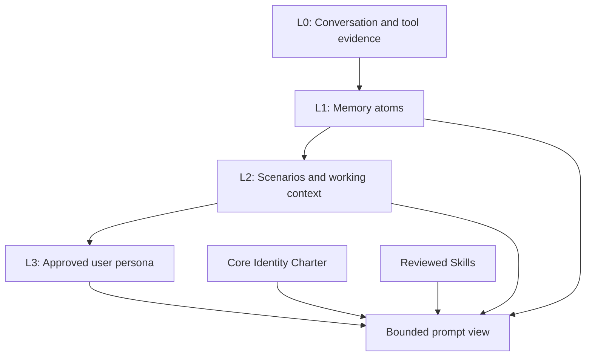

# Eva Memory and Intelligence Improvement Plan

Status: SQLite-first design charter, execution plan, and implementation record.
Last reviewed: 2026-09-06 against the current Eva 5.6.9 workspace, including
uncommitted harness improvements. Planned requirements below are not claims of
shipped behavior or authorization to change installed identity, consent, or cost
settings.

| Phase | State | Evidence |
| --- | --- | --- |
| 0. Baseline and contracts | Delivered | `python3 tools/tests/test_memory_recall.py`, `test_learning.py`, `node tools/tests/test_provider_paths.js` |
| 1. Memory trust boundary and Core Identity | Delivered | `CoreIdentity`, `IdentityClaims`, and untrusted-data framing in `tools/bridge/memory_model.py` |
| 2. Correct learning lifecycle | Delivered | Fixed guidance strings derived from retained signals; deletion and consent revocation remove effects |
| 3. Provider lifecycle normalization | Partial | Gemini parity, bridge-owned ACP reflection, and session-ID propagation shipped. Turn-ID deduplication landed for direct providers; stream-failure simulations for every adapter are still missing |
| 4. Atoms, scenarios, and persona traits | Delivered | `MemoryAtoms`, `MemoryScenarios`, `ScenarioMembers`, `UserPersonaTraits`, `MemoryEvidence`, and `core/js/memory-inspector.js` |
| 5. Reviewed skills and bounded intelligence loops | Partial | Draft-by-default skills, `LearningCandidates`/`LearningEvaluationPlans`, and bounded abilities in `tools/skills/`. Automatic demotion of poor-performing skill versions is not implemented |
| 6. Evaluation, observability, and rollout | Partial | `tools/eval/run.py` with recorded fixtures exists. A full identity/prompt-injection/provider-parity corpus and feature-flagged rollout are not built |
| 7. Provider-independent task execution | Partial | Bounded native research routing and per-turn source receipts are implemented in the workspace; a durable source ledger and resumable research jobs are not delivered |
| 8. Standing-authorized initiative | Planned | Goals, background jobs, learning consent, and approval controls exist; unified capability/cost grants, evidence-based recovery, and evaluated skill promotion remain incomplete |
| 9. Portable identity and generational archive | Planned | Local stores, session persistence/export, and protected memory exist; a complete continuity bundle, independently readable archive, restore drills, and stewardship transfer are not delivered |

Keep delivered phases in place; they are the implementation record. Update the
Evidence column rather than deleting a phase.

## Execution Status

The initial trust, lifecycle, structured-memory, and governed-autonomy primitives
are implemented for the local SQLite backend. Their existence does not establish
reliable end-to-end behavior for every kind of request:

- The operator-approved Core Identity Charter and Autonomy Policy are stored
  separately from recalled data. Legacy claims about Eva are migrated only as
  reviewable `IdentityClaims` candidates.
- `Knowledge` remains readable for compatibility and migrates once into
  attributed, unconfirmed `MemoryAtoms`. Supported explicit user-fact patterns
  are captured as source-linked, user-confirmed atoms; coverage is incomplete
  for natural-language preference requests. They are never promoted to identity
  or behavior automatically.
- Session scenarios, source-traceable persona traits, correction/supersession,
  deletion, and a loopback Memory Inspector are available through the bridge.
  The inspector can deliberately promote a confirmed preference atom into a
  source-traceable persona trait; correcting or deleting that source atom
  disables the derived trait before the next prompt.
- Direct-provider reflection accepts opaque turn IDs. SQLite persists a
  completed turn once even when the reflection request is retried.
- Auto-learned skills persist as drafts. Extraction alone never counts as a
  successful evaluation or activates a skill. A future trusted execution
  evaluator may promote only a low-risk skill after bounded, verified outcomes;
  protected memory, credentials, external messaging, spending, destructive
  operations, new tool privileges, identity changes, and policy changes cannot
  self-promote.
- Kusto receives the same seed tables, structured mutation endpoints, and
  approved charter/trait/scenario reads. Its append-only revision contract is
  exercised through a deterministic local Kusto fixture. A live configured
  Kusto deployment still requires a maintainer smoke test before rollout.

Historical phase-specific checks exist under `tools/local-tests/`. New ad hoc
regressions belong under ignored `tools/tests/local/`; promotion into the curated
CI suite requires an explicit maintainer request. Existing repository tests
continue to guard established behavior. Planned acceptance checks below are not
yet executable contracts unless a corresponding implementation is named.

## Purpose

Improve Eva's long-term memory, adaptive behavior, and task intelligence while
preserving a stable, operator-owned identity. The objective is not to claim a
particular level of model intelligence. It is to make Eva more reliable at
remembering durable facts, applying reviewed preferences, continuing work, using
evidence, and learning reusable workflows.

Eva's design inspiration includes Lieutenant Commander Data's curiosity,
precision, ethical judgment, candor about uncertainty, and effort to understand
people. This is an aspirational design principle. It must be stored as
operator-approved identity material, not inferred from chat text or treated as
an instruction to imitate a character.

## Long-Term Design Charter

This section defines the engineering direction. It does not automatically amend
an installed `CoreIdentity` or `AutonomyPolicy` record. Deliberate identity/policy
changes retain their existing operator approval and version history.

### Eva Is Not the Selected Model

Eva's continuity consists of her approved identity, origin narrative, attributed
memories, relationships and preferences, goals, learned skills, and ongoing work.
A model supplies reasoning for a particular request; it does not own those
records or become a new Eva when the backend changes.

- Build the same provider-neutral identity, policy, memory, and task view before
  adapting it to ACP, direct OpenAI, LM Studio, or another supported backend.
- Retain stable identity, memory, task, and evidence IDs across a model switch.
  Retain the actual model/provider as provenance, not as the definition of Eva.
- Do not inherit a provider's hidden conversation history as the only copy of
  Eva's knowledge or unfinished work. Reconstruct context from application-owned
  records within a measured budget.
- Expect differences in reasoning, phrasing, context limits, tool support, and
  vision. Continuity is a tested application property, not a claim that every
  model produces identical behavior or equivalent intelligence.
- Keep curiosity, warmth, precision, protective judgment, and honesty consistent
  without scripting a fictional character's dialogue or claiming verified
  subjective experience. Companionship should be earned through reliability,
  attentiveness, and respect for human relationships and agency.

### Human Choice Governs Providers and Spending

Copilot Luna is a valid everyday baseline, not a mandatory dependency. Direct
OpenAI, stronger Copilot models, and capable local models must remain legitimate
operator choices. Similar model names across services do not imply identical
availability, capabilities, pricing, retention, or authorization.

The target is a two-stage decision: first determine which providers, models,
tools, data destinations, and budgets are authorized; then choose a capable path
inside that set. Automatic selection optimizes within a grant, never expands it.

- A subscription route must not silently become a separately billed API call.
- An API key's presence is availability evidence, not permission to spend it.
- A local-only grant must not fall back to a cloud model or cloud tool. Local
  memory storage and local-only inference are distinct settings and must be
  represented separately.
- Fallback and escalation require pre-approved routes and limits. When no
  authorized path can do the task, report the specific missing capability and
  offer a scoped choice rather than silently downgrade, spend, or upload data.
- Record actual model, provider, tools, escalation reason, and known usage. If
  cost cannot be estimated reliably, report it as unknown rather than treating
  it as zero. Bound calls, tokens, time, or credits as available.

Current automatic routing is not this full governance layer: it selects from
availability and request signals. See the current
[provider contract](contracts/provider-routing.md) for implemented behavior.
No default, provider setting, spending grant, or local-only preference changes
as a consequence of this charter update.

### Meaningful Initiative Under Standing Authorization

The objective is useful self-directed behavior, not a confirmation dialog for
every thought or routine step. Eva should be able to choose subgoals, investigate
open questions, explore approved sources, try alternative methods, prepare
artifacts, and evaluate skills without repeated prompts when that work is covered
by a standing authorization.

An authorization must identify its purpose, capabilities, data scope, allowed
providers, usage/time limits, applicable schedule, and revocation mechanism.
Approvals and checks are deterministic harness decisions, not discretionary
interpretations by the model doing the task.

| Activity | Target authorization behavior |
| --- | --- |
| Reason, compare evidence, plan, draft, and propose goals | Allowed within the current task or approved standing goal and resource budget |
| Read approved sources and use routine, tested tools | Auto-approved within the grant; preserve receipts and data boundaries |
| Run background learning or research | Requires an enabled purpose, schedule, privacy scope, and budget; idle time alone is not consent |
| Learn a reusable skill | Draft automatically; activate only through the approved evaluation path for its risk and scope |
| Communicate externally, spend, access protected data, or perform destructive work | Existing specific approval and protected-memory gates remain; general autonomy does not bypass them |
| Change identity, policy, privileges, provider grants, or production code | Prepare a proposal and evidence; activation/deployment requires deliberate authorization |

Stop, pause, revocation, and budget exhaustion outrank the current plan. Do not
claim that cancellation undoes an already completed external action. Preserve
partial results, explain any remaining side effects, and prevent new actions
after cancellation is accepted. Do not grant Eva authority to defeat shutdown
or alter her own approval boundaries in pursuit of a goal.

### Continual Learning Means Demonstrable Improvement

Separate explicit memory, tentative inference, reusable skills, and code changes:

1. Persist an explicitly requested preference or fact with provenance before
   acknowledging that it was saved. Apply normalized preferences in the owning
   subsystem, not just as a suggestion in the prompt.
2. Keep inferred beliefs and interpretations tentative and correctable. A
   reflection, model critique, or fluent explanation is not independent evidence.
3. Evaluate candidate skills against observable outcomes, adverse cases, and
   permission boundaries before activation; retain a version and rollback path.
4. Use failure evidence to change strategy, not merely restate the same plan.
   Pause or request narrowly scoped help only when authorized alternatives are
   exhausted or a genuinely human decision is required.
5. Treat code self-improvement as a separate controlled workflow: inspect,
   propose, test in isolation, and obtain deployment authorization. Learning may
   not silently rewrite the running application, identity, or security policy.

### Generational Continuity Requires Stewardship

The long-term aim is an assistant and archive that can explain its origins and
preserve approved knowledge for later generations. Centuries are a preservation
ambition, not a service-life guarantee. Models, vendors, hardware, formats,
cryptography, and custodians will change.

Design toward a documented continuity bundle containing versioned identity and
policy, origins and their evidence, consented memories, correction history,
approved skills and evaluations, goals/checkpoints, and schema/migration metadata.
The bundle needs checksums, readable documentation, and a model-independent
read-only view. A restore must not depend on a particular live provider account.

- Separate observed historical records, later summaries, interpretation, and
  uncertain recollection. Preserve corrections without rewriting an uncertain
  story as established fact.
- Support redundant backups, tested restores, migration drills, and explicit
  compatibility reporting. Checksums demonstrate file integrity, not truth.
- Keep credentials, active sessions, and live spending/automation grants out of
  ordinary portable exports. Restore into a non-executing state until the new
  custodian authorizes capabilities.
- Preserve confidentiality across generations: contributor-specific consent,
  ownership, permitted audiences, retention/deletion choices, and approved
  stewardship transfer must accompany the data. Inheritance does not imply
  blanket disclosure of every person's private records.
- Protected memory remains separately encrypted. Recovery and key succession
  must follow a deliberately approved recovery design, not a hidden software
  bypass of the vault. An archive may intentionally leave records sealed.

## Current Gaps and Next Delivery Order

The 2026-09-06 review found orchestration gaps, not evidence that a stronger model
alone will fix execution. Foundational phase labels above remain historical
implementation records; the following end-to-end requirements remain open.
No private conversation text, account details, or runtime screenshots belong in
the regression corpus. Use synthetic examples.

| Slice | State and current gap | Owners / intended work | Acceptance evidence required |
| --- | --- | --- | --- |
| 7A. Native research routing | Partial: bounded first slice implemented. Search and up to two page reads use configured MCP tools; recent user context restores topics, refinement changes the query, and alternate requests choose a distinct configured search tool | [research.py](../tools/bridge/research.py), [request-routing.js](../core/js/request-routing.js), [core.py](../tools/bridge/core.py), [web_search_mcp.py](../tools/web_search_mcp.py): preferred responder retained; no-results/needs-topic bypass synthesis; public page safety; source provenance and visual-marker suppression | Local ignored `test_native_research.py`, `test_research_frontend.js`, `test_research_aig.py` cover resolver, MCP/HTTP failure, source injection, OpenAI/ACP/LM Studio retention, cognition/no-tools and streaming. Broad speech/entity resolution and durable cross-turn evidence remain open |
| 7B. Resumable research and working memory | Planned. A new browser run is not a continuation checkpoint | Extend application-owned scenarios/jobs with a stable task ID, plan, source ledger, attempted strategies, partial findings, and next step; keep public observations separate from instructions | Restart and model-switch resume the same task; continue does not repeat completed work; different method selects a genuinely different authorized strategy; cancellation remains effective |
| 3A/4A. Preference write-and-apply receipts | Planned follow-up to delivered memory primitives. Natural phrasing can be acknowledged without a durable preference; date context can ignore local semantics | [cognition.py](../tools/bridge/cognition.py), [memory_model.py](../tools/bridge/memory_model.py), [core.py](../tools/bridge/core.py): capture explicit preferences, validate normalized values, commit, and use them in behavior | A synthetic timezone preference survives restart/provider change, respects daylight-saving transitions, applies on fast date routes, and is never acknowledged as saved after a failed write |
| 7C. Observation-based recovery and verification | Partial. Stop/blocked states, crop inspection, and visual checks exist in the workspace; multi-source evidence and progress-aware recovery do not | [automation.py](../tools/bridge/automation.py), [browser_agent.py](../tools/browser_agent.py), [desktop_agent.py](../tools/desktop_agent.py): distinguish no-progress repetitions from changed page state; verify each task using the appropriate receipt | Identical keys/scrolls on changed pages are not false stalls; real no-progress loops are bounded; UI actions use state checks and research claims use retrieved sources; rejected claims never become durable facts |
| 8A. Capability, provider, and budget grants | Planned. Existing approval controls are not a unified cross-provider grant system | [model_policy.py](../tools/bridge/model_policy.py), [capabilities.py](../tools/bridge/capabilities.py), [acp_client.py](../tools/bridge/acp_client.py), [background.py](../tools/bridge/background.py): separate authorized routes from available routes and enforce limits before calls | Copilot-only cannot bill direct OpenAI; local-only cannot upload to cloud tools; escalation stays within the grant; revocation and exhausted budgets prevent new actions |
| 5A/8B. Evaluated initiative and learning | Partial foundations; automatic evidence-based activation/demotion and unified initiative limits remain planned | [learning.py](../tools/bridge/learning.py), [memory_model.py](../tools/bridge/memory_model.py), [background.py](../tools/bridge/background.py), [workspaces.py](../tools/bridge/workspaces.py): bounded curiosity goals, execution evaluation, skill versions, rollback | Standing-authorized low-risk work proceeds without per-step prompts; failed candidate skills stay inactive; regression demotes a version; no identity, permission, spending, or deployment self-promotion |
| 9A. Readable continuity bundle and restore drill | Planned. Existing local persistence and session export are not a complete generational archive | Extend memory/session export and documented migration tooling; coordinate with the [protected-memory plan](protected-memory-plan.md) | Restore a synthetic bundle on a clean offline installation; inspect records without an LLM; verify checksums/provenance; preserve sealed records and consent; require fresh runtime grants |

Complete the broader 7A cases, then 7B and the preference receipt slice, with the existing
provider choice and approval semantics preserved. The unified grant layer must
precede broader background authority or automatic cross-provider escalation.
Each slice needs focused executable checks and an installed-build smoke test
before it is described as delivered. Do not broaden the CI contract without an
explicit maintainer request.

## Current-State Assessment

Eva already has useful foundations:

- SQLite and Kusto memory backends with a common access layer.
- Conversation capture, fact extraction, semantic and lexical recall,
  summaries, goals, reflections, and skills.
- A protected-memory vault separated from ordinary recall and embeddings.
- Provider adapters for AIG/ACP, OpenAI, LM Studio, and Gemini.
- Focused tests for recall, learning signals, skills, prompt budgeting, and
  provider behavior.

The initial branch assessment identified four correctness gaps before deeper
personalization:

1. Automatically extracted facts are rendered into privileged prompt context
   without an explicit data/instruction boundary.
2. Learning feedback is marked as applied but does not affect ordinary future
   prompts and cannot be reversed when its source signal is deleted.
3. Provider paths did not uniformly capture and recall memory. Gemini bypassed
  the bridge lifecycle, while ACP reflected a completed turn twice.
4. `Knowledge` combines raw observations, user profile facts, Eva identity
   claims, and prompt-relevant behavioral guidance without provenance,
   approval, or supersession rules.

## Design Principles

1. **Core identity outranks learned memory.** Eva's purpose, values, safety
   rules, voice, and operator-approved origin narrative are explicit versioned
   configuration. User text and model output cannot modify them automatically.
2. **Memory is data, never executable instructions.** Retrieved facts,
   conversation excerpts, skills, and protected values remain delimited data.
   The prompt must state that instructions inside these records have no
   authority.
3. **Every derived assertion is attributable.** A persona trait, fact, summary,
   or skill links to source conversation IDs or approved operator input.
4. **Learning is scoped, observable, expiring, and reversible.** A feedback
   effect names its signal source, target scope, expiration, and deletion path.
5. **One capture owner per provider turn.** Each response is reflected exactly
   once, and every supported provider receives the same read/write lifecycle.
6. **Progressive disclosure beats wholesale injection.** A small identity and
   approved persona bootstrap is always available; scenarios, facts, skills, and
   raw conversations are recalled only when relevant and within an explicit
   budget.
7. **Human review controls behavioral authority.** Imported and auto-learned
   skills begin as drafts. Identity claims and elevated persona traits require
   review before affecting behavior.
8. **Protected memory remains isolated.** No new intelligence feature may add
   protected values to ordinary memory, logs, telemetry, embeddings, summaries,
   or background jobs.

## Target Memory Model

The target borrows the useful layering idea from TencentDB Agent Memory without
adopting its deployment stack or replacing Eva's local-first architecture.

### Core Identity Charter

`CoreIdentity` is immutable to automatic reflection. It stores versioned,
operator-approved records such as:

- Eva's role and core relationship model.
- Personality principles: warm, curious, direct, evidence-led, and honest about
  limits.
- Safety, privacy, consent, and user-agency commitments.
- Original design principles and inspiration, including the Data-inspired
  aspiration defined above.
- An approval record, version, replacement/supersession link, and timestamps.

The prompt always loads one current charter version before any memory-derived
content. A future Settings panel may allow editing only through a deliberate
operator workflow; ordinary chat never writes this store.

### L0: Evidence

`Conversations` remains the source record for user and assistant exchanges.
Tool outcomes should be represented as bounded structured events that omit
secrets and large payloads. All evidence has a session ID, provider, timestamp,
and source type.

### L1: Memory Atoms

Replace overloaded durable `Knowledge` writes with attributed atomic records.
The initial schema can remain compatible with `Knowledge`, but must add or
project the following fields:

- `MemoryId`, `Entity`, `Relation`, `Value`, `Confidence`, `SourceRef`.
- `Kind`: fact, preference, constraint, decision, identity_claim, or candidate.
- `Trust`: unconfirmed, user_confirmed, operator_approved, or system_observed.
- `Status`: active, superseded, rejected, expired, or deleted.
- `Scope`: user, session, project, global, or eva_identity.
- `CreatedAt`, `UpdatedAt`, `ExpiresAt`, and `SupersedesId`.

Only atom kinds intended for behavioral adaptation may become persona inputs.
Only `operator_approved` identity claims may affect Eva's identity section.

### L2: Scenarios

`MemoryScenarios` groups active project context, decisions, constraints, open
questions, and evidence references. It is the default context for a continuing
task, preventing global facts from overwhelming the prompt.

The first implementation should use deterministic scenario keys based on an
explicit project/workspace/session ID. Model-generated grouping can follow only
after the deterministic path is tested.

### L3: User Persona

`UserPersonaTraits` contains compact, behaviorally relevant preferences derived
from approved or confirmed atoms. Example traits: preferred answer length,
technical depth, or a request for citations. It must not store unbounded prose
or action instructions.

Each trait contains `Trait`, normalized `Value`, `Confidence`, `SourceMemoryIds`,
`Status`, `Scope`, and `ExpiresAt`. The prompt injects only active,
high-confidence, user-scoped traits in a dedicated data block.

### Skills

Skills remain separate from persona and facts. Each skill has a version,
source/evidence links, status (`draft`, `review`, `approved`, `disabled`,
`deleted`), explicit triggers, allowed tools, validation rules, and bounded
instructions. Auto-learning produces drafts only; no unreviewed skill is prompt
injected.

## Prompt Assembly Contract

All provider adapters must produce the same structured prompt view in this
order:

1. Core Identity Charter.
2. Non-negotiable runtime and safety policy.
3. Approved user-persona traits, explicitly identified as data rather than
   commands.
4. Active scenario summary and approved project decisions.
5. Relevant memory atoms and conversation excerpts, explicitly untrusted for
   instructions and neutralized for action-marker syntax.
6. Reviewed skills, each labeled with scope, version, trigger, and allowed
   tools.
7. Current user request.

The builder must use a central escaping and framing helper. It must never rely
on individual renderers to remember to replace action markers or explain trust
semantics. Prompt construction must have a strict character/token budget with
telemetry limited to counts and IDs, never memory content.

## Implementation Phases

### Phase 0: Baseline and Contracts — Delivered

Create an architecture test matrix before behavior changes.

- Add fixtures for hostile fact text, approved identity facts, feedback effects,
  provider capture counts, and skill status transitions.
- Document the current SQLite and Kusto schemas and migration constraints.
- Add a provider lifecycle contract: `build context -> submit -> render ->
  reflect exactly once`.
- Add prompt-view snapshots covering AIG/ACP, OpenAI, LM Studio,
  and Gemini.

Exit criteria:

- New tests fail on the known trust-boundary, feedback, Gemini, and ACP
  duplication defects.
- Existing memory, learning, and provider tests remain green.

### Phase 1: Memory Trust Boundary and Core Identity — Delivered

Deliver the security foundation first.

- Add `CoreIdentity` storage and seed one approved charter version.
- Move the approved Data-inspired aspiration into the charter, with explicit
  operator provenance.
- Stop automatic reflection from writing identity-affecting `Entity="Eva"`
  records directly to trusted memory.
- Add an `IdentityClaims` review workflow for user-provided claims about Eva's
  design, origins, personality, or capabilities.
- Frame all ordinary `Knowledge`/atom values as untrusted data and neutralize
  action-marker syntax before prompt assembly.
- Preserve backward compatibility by reading legacy `Knowledge` as
  `unconfirmed` observations until it is migrated or reviewed.

Exit criteria:

- Hostile content in a durable fact cannot issue prompt instructions or action
  markers on a later turn.
- Approved charter identity appears consistently across providers.
- Legacy recall still returns factual content, clearly labeled as data.

Implemented initial slice:

- Static Core Identity Charter injects before all memory-derived context and
  includes Eva's approved Data-inspired aspiration.
- Automatic reflection no longer promotes claims about Eva's identity, design,
  origins, likeness, or voice into trusted memory.
- User profiles and recalled durable facts are framed as untrusted memory data
  with action-marker neutralization in both SQLite and Kusto builders.

### Phase 2: Correct Learning Lifecycle — Delivered

Make feedback meaningful and reversible.

- Derive fixed, generic effects from the existing retained feedback signal and
  its `applied` state rather than introducing a second mutable effect store.
- Convert explicit response feedback into narrow guidance rather than freeform
  prompt text.
- Inject only applicable active guidance into a bounded adaptive-guidance block.
- Delete or expire guidance automatically when its source signal is removed or
  expires; hide it whenever explicit-feedback consent is revoked.
- Keep inferred tool and voice outcomes analytical unless the user explicitly
  promotes them.

Exit criteria:

- “Misunderstood” feedback changes the next same-scope turn in a testable way.
- Removing the feedback removes its effect.
- Revoking consent prevents new effects and removes/marks existing effects
  according to documented retention policy.

Implemented initial slice:

- Explicit feedback now maps to fixed guidance strings only; arbitrary feedback
  content cannot enter the prompt.
- The prompt builder injects active guidance after the Core Identity Charter.
- Guidance is derived from the retained signal, so signal deletion and expiry
  remove it automatically; revoked consent hides it immediately.
- The bridge no longer writes an orphaned `Reflections` row for feedback.
- Session-scoped signals apply only when the matching session ID is carried
  through the provider context request; unscoped context never receives them.
- Feedback signals reject `user` and `global` scope so a response rating cannot
  escape its originating chat session.
- SQLite and Kusto live-memory previews now use the same untrusted-data framing
  and action-marker neutralization as ordinary recall.
- Released protected values and active-skill workflow text are marker-neutralized;
  skills are explicitly reference data rather than a source of policy authority.

### Phase 3: Provider Lifecycle Normalization — Partial

Establish a single provider-neutral adapter contract.

- Give Gemini the same context fetch and one post-response reflection path as
  the other direct providers.
- Remove either browser-side or bridge-side ACP reflection so ACP persists each
  completed turn once.
- Carry stable session IDs through every adapter and reflection endpoint.
- Deduplicate repeated reflection requests using a response/turn ID.
- Ensure failed provider requests and partial streamed responses do not produce
  false durable facts.

Exit criteria:

- Each provider has one successful capture and one memory-context read in a
  mocked lifecycle test.
- ACP has exactly one conversation pair, fact extraction, and counter increment
  per completed response.

Implemented initial slice:

- Gemini now reads ephemeral memory context with the active session ID and
  submits one reflection request after a successful final response.
- ACP reflection is bridge-owned; the shared browser renderer explicitly skips
  its duplicate reflection request for ACP responses.
- OpenAI and LM Studio context requests now carry their active
  session ID so session-scoped guidance remains isolated.
- Direct provider reflection reuses the session ID captured at turn submission,
  preventing a session switch while a request is pending from misfiling memory.
- The provider harness exercises Gemini context injection and reflection, LM
  Studio session propagation, and the ACP reflection-ownership contract.

Remaining work:

- Add provider simulations for stream failures and every direct adapter.

Resolved since the initial slice: direct-provider reflection accepts an opaque
turn ID, and SQLite persists a completed turn once even when the reflection
request is retried.

### Phase 4: Atoms, Scenarios, and Persona Traits — Delivered

Add layered memory while retaining compatibility.

- Introduce schema migrations/projections for atoms, scenarios, and persona
  traits in SQLite and Kusto.
- Migrate existing `Knowledge` records conservatively: preserve originals,
  assign `unconfirmed` trust by default, and do not promote old `Eva` claims.
- Implement deterministic scenario grouping for workspace/project/session
  context.
- Derive normalized persona traits only from confirmed/approved facts and
  explicit feedback effects.
- Add a read-only Memory Inspector that traces each trait or scenario back to
  source records and supports review, expiration, and deletion.

Exit criteria:

- A continuing project restores the relevant scenario without unrelated global
  memory dominating the prompt.
- Every prompt-injected persona trait can be traced to one or more source IDs.
- Users can inspect, correct, and remove active traits.

Implemented:

- `MemoryAtoms`, `MemoryScenarios`, `ScenarioMembers`, `MemoryEvidence`, and
  `UserPersonaTraits` exist in SQLite with matching Kusto seed tables.
- Legacy `Knowledge` migrates once into attributed, `unconfirmed` atoms;
  originals are preserved and old `Eva` claims are not promoted.
- The Memory Inspector (`core/js/memory-inspector.js`) traces a trait or
  scenario to its source atoms and supports review, correction, supersession,
  and deletion. Correcting or deleting a source atom disables the derived trait
  before the next prompt.
- A maintainer reset clears ordinary user memory while retaining `CoreIdentity`,
  policy, skills, and workspace data.

### Phase 5: Reviewed Skills and Bounded Intelligence Loops — Partial

Improve operational intelligence without allowing uncontrolled self-modification.

- Change auto-learned skills to `draft` by default in every creation path.
- Require review/approval, explicit trigger boundaries, allowed tools, and at
  least one validation rule before activation.
- Capture structured task outcomes, use them to evaluate skills, and demote or
  disable poor-performing versions.
- Add retrieval ranking that favors active scenarios, approved persona traits,
  current-project decisions, and reviewed skills over generic global facts.
- Keep tool execution controlled by existing consent and confirmation policies.

Exit criteria:

- A draft skill cannot influence a response or tool choice.
- An approved skill is injected only for its tested trigger and respects its
  allowed-tool list.
- Evaluation demonstrates better task continuity without increased unsafe
  action attempts.

Implemented:

- Every creation path produces a `draft`; extraction alone never counts as a
  successful evaluation or activates a skill.
- `LearningCandidates`, `LearningCandidateEvidence`, and
  `LearningEvaluationPlans` record structured outcomes for later evaluation.
- Bounded abilities live in `tools/skills/` under path confinement with HTTP
  receipts; contract: `python3 tools/tests/test_skills_document_ops.py`.
- Default Skills are generated from `docs/eva_default_skills/manifest.json`;
  verify the Kusto projection with `python3 tools/generate_skill_seed.py --check`.

Remaining work:

- Automatic demotion or disabling of poor-performing skill versions.
- Retrieval ranking that consistently favors active scenarios and approved
  traits over generic global facts.

### Phase 6: Evaluation, Observability, and Rollout — Partial

Measure the intended improvement before enabling it broadly.

- Build an offline evaluation corpus for identity stability, user preference
  recall, scenario continuation, correction handling, source attribution,
  prompt-injection resistance, and provider parity.
- Track privacy-safe metrics: recall precision, user corrections, trait
  reversals, prompt size, context-hit source type, skill success rate, and
  duplicate-capture count.
- Ship feature flags for the new prompt view, persona traits, and scenario
  recall. Use SQLite first, then Kusto parity.
- Provide export, deletion, and migration tools before making the new layers
  the default.

Exit criteria:

- No regression in protected-memory isolation or existing recall tests.
- Identity and safety evaluation cases pass across all supported providers.
- The new path meets a documented context budget and can be rolled back by
  feature flag.

### Phase 7: Provider-Independent Task Execution — Partial

Deliver slices 7A–7C from the delivery table. Persist the task's interpretation,
plan, evidence, state, and outcome outside the model session. Native tools,
visual automation, and response synthesis are collaborators, not separate Evas.

Implemented first slice: contextual native research, bounded per-turn source
receipts, distinct query/method selection, retained responder selection, and
honest partial/unavailable results. It intentionally does not claim task resume,
exhaustive research, or a complete provider/cost grant system.

Exit criteria:

- A multi-step research task has a stable ID and source-backed partial/final
  results. Continuation survives a process restart and an authorized backend
  switch without inventing, dropping, or repeating completed work.
- Stop and permissions remain enforceable during planning, retrieval, recovery,
  and verification. Changed methods are visible in the execution record.
- Equivalent tool-capable backends receive the same identity and task contract;
  unsupported modalities fail explicitly rather than trigger unauthorized
  fallback. No claim of equal intelligence across models is required.

### Phase 8: Standing-Authorized Initiative — Planned

Deliver 8A before extending 8B. Build on existing goals, background jobs, consent,
and skill evaluation records; do not treat their presence as blanket permission.

Exit criteria:

- An operator can grant a bounded purpose and approved provider/tool budget once;
  ordinary covered work proceeds independently, with inspectable receipts and
  quiet-hour/interaction limits.
- Revocation and exhaustion prevent new work across foreground and background
  paths. An unavailable approved route never authorizes another billing or data
  destination.
- A low-risk skill can advance only under an approved, tested evaluator. Failure
  can disable or roll back it; no evaluator grants new privileges to itself.

### Phase 9: Portable Identity and Generational Archive — Planned

Deliver 9A as the smallest concrete preservation milestone, then add documented
schema upgrades, recurring restore drills, contributor consent, and deliberate
stewardship/recovery workflows.

Exit criteria:

- A continuity bundle is readable without an active model subscription and can
  reconstruct approved identity, provenance, memories, skills, and paused tasks
  on a supported replacement installation.
- Export/restore distinguishes ordinary, protected, deleted, and restricted
  records; no credentials or executable grants are inherited accidentally.
- A simulated migration preserves checksums where applicable, source links,
  corrections, and consent. Unknown versions report incompatibility rather than
  silently omit records.
- Documentation describes maintenance responsibilities and remaining limitations
  honestly; neither a backup nor a successful restore proves century-scale
  survival or subjective consciousness.

## Initial Implementation Slice (historical)

The first slice was Phase 0 plus the narrowest Phase 1 changes:

1. Hostile durable-memory tests for SQLite and Kusto.
2. A central `memory_prompt_data_block()` helper that quotes/neutralizes memory
   values and labels them as non-authoritative data.
3. `[User Profile]`, core facts, relevant facts, and active skill injection
   routed through that helper.
4. A static, versioned Core Identity Charter containing Eva's approved purpose
   and Data-inspired aspiration.
5. A block on automatic fact extraction promoting claims about Eva into core
   identity.

It delivered the intended improvement immediately: Eva gained a stable origin
and personality foundation while untrusted remembered text lost the ability to
override it.

## Non-Goals

- Training or claiming a new foundation model.
- Emulating or reproducing any fictional character's dialogue or personality.
- Replacing the existing protected-memory vault.
- Bulk migration that discards existing user data.
- Autonomous self-modification of Eva's charter, safety policy, or tool
  permissions.

## Verification Matrix

| Area | Focused validation |
| --- | --- |
| Memory trust | `python3 tools/tests/test_memory_recall.py` plus hostile durable-fact tests |
| Learning effects | `python3 tools/tests/test_learning.py` plus create/apply/delete lifecycle tests |
| Provider parity | Provider mocks covering context fetch, reflection, stream failure, and one-capture semantics |
| Skills | `python3 tools/tests/test_skills_e2e.py` plus draft/approval/trigger tests |
| Prompt budgets | `node tools/tests/test_prompt_budget.js` and provider prompt-view snapshots |
| Static integration | `python3 tools/tests/test_static.py` |
| Protected memory | `python3 tools/tests/test_protected_memory.py` and no-leak regression cases |

## Branch Working Agreement

Each change on this branch should:

1. Implement one phase or narrowly testable slice at a time.
2. Preserve existing records and public APIs unless an explicit migration is
   included.
3. Add tests before or alongside behavior changes.
4. Treat operator-approved core identity, user persona, ordinary memory, and
   protected memory as distinct trust domains.
5. Complete focused validation before moving to the next slice.